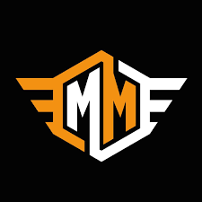

# Hi there, I'm Yanir! 👋

 

A developer and robotics enthusiast focused on building interactive applications, exploring game engines, and solving complex problems through code.

---

## 🤖 Robotics & Engineering
I am an active team member at **[MishMash FTC 12016](https://www.facebook.com/MishMashFTC/)**.

## 🛠️ Tech Stack

| Category | Tools & Languages |
| :--- | :--- |
| **Languages** |     |
| **Frameworks** |    |
| **Development** |    |

## 🚀 Projects

### 🖥️ Desktop & Tools
* **[AniNeko](https://github.com/YanirValdman/AniNeko)**  
  * Open-source desktop cat characters that interact with your workspace.
* **[FemboyVC](https://github.com/YanirValdman/FemboyVC)** 
  * Cute Voip (˶˃ ᵕ ˂˶) .

### 🎮 Minecraft & Game Modding
* **[CountingDeaths](https://github.com/YanirValdman/CountingDeaths)** 
  * Utility plugin to track mortality stats.
* **[StepSis](https://github.com/YanirValdman/StepSis)** 
  * Shulker in a Shulker.
* **Retro Modding( will be added later on (>ᴗ•) )** 
  * Sprite replacement and asset management for Doom 2.

---

> "Hard work beats talent when talent doesn't work hard."

